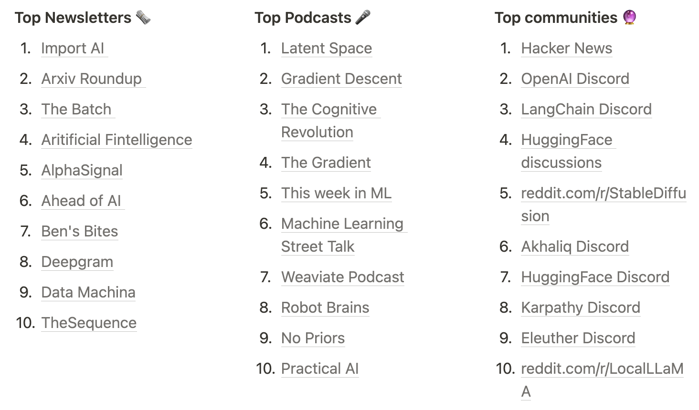

{: width="60%" }

# Table of contents
- [Conference](#conference)
- [Getting Started](#getting-started-resources)
- [Materials from Talks and Workshops](#materials-from-talks-and-workshops)
- [Interesting Companies/Projects in the Space](#interesting-companiesprojects-in-the-space)
- [Who's Hiring](#whos-hiring)
- [And Beyond](#and-beyond)

I was fortunate to attend the inaugural AI Engineer Summit conference. It was a great experience, not only because it was my first time in the US, but specifically because the conference content was so packed with value. I especially liked the Sunday pre-conference workshop whose aim was to prep attendees for topics they will encounter at the conference. This was really useful, especially for a niche that’s evolving this fast.

Now that the dust has settled, I took some time to aggregate all the materials that have been shared so far, as well as some that I collected during the talks and workshops. Hopefully it will serve everyone who didn’t make it to the conference in-person or remote, or anyone wanting to learn about the space. Not everything is available here as I couldn’t attend all workshops and not all slides have been shared; I’ll try to update as other material is shared.

# [Conference](#conference)

* Conference page: [AI Engineer Summit](https://www.ai.engineer/summit)
* Youtube livestreams:
  * day 1: [AI Engineer Summit 2023 — DAY 1 Livestream](https://www.youtube.com/watch?v=veShHxQYPzo)
  * day 2: [AI Engineer Summit 2023 — DAY 2 Livestream](https://www.youtube.com/watch?v=qw4PrtyvJI0)
* the Fixie.AI team has built a [RAG app](https://embed.fixie.ai/embed/benlower/aies/2092e799-6fb3-4bde-b50d-1ca0c8af0bb4?agentStartsConversation=1) based on the livestream videos that you can chat with about the conference here

# [Getting Started Resources](#getting-started-resources)

A roundup of resources shared by attendees on what they would recommend as "getting started" guides:
* [AI 101](https://docs.google.com/presentation/d/19wEaJvOTR4ec40vXyWLKziMGQ861XA-QQqs8XAR4co0/edit?pli=1#slide=id.p1): the first prep workshop held at the conference
  * Repo: [nheingit/AI-101: ai.engineer ai-101 workshop](https://github.com/nheingit/AI-101)
* [AI Engineering 201](https://docs.google.com/presentation/d/1g_7gSCJc5sK908D42bzSsYykSI6rXi1pFzyf-Ghkox8/edit#slide=id.p): follow up to the 101 workshop, a whirlwind tour of more advanced topics
  * Charles is working on [Full Stack Deep Learning](https://fullstackdeeplearning.com/), here's a longer video course: [LLM Bootcamp 2023](https://www.youtube.com/watch?v=twHxmU9OxDU&list=PL1T8fO7ArWleyIqOy37OVXsP4hFXymdOZ)
* Eugene Yan: [Patterns for Building LLM-based Systems & Products](https://eugeneyan.com/writing/llm-patterns/)
  * [a twitter roundup of earlier models by the same author](https://twitter.com/eugeneyan/status/1670271775337480193)
* [Prompt Engineering Guide](https://www.promptingguide.ai/)
* [Generative AI from Scratch (YT Playlist)](https://www.youtube.com/watch?v=lnA9DMvHtfI&list=PLWfDJ5nla8UoR8P7AGqVw7ZPjXajUFLMo)
* Deep Learning AI has two great intro courses in collaboration with
  * LangChain: [LangChain for LLM Application Development](https://www.deeplearning.ai/short-courses/langchain-for-llm-application-development/)
  * OpenAI: [ChatGPT Prompt Engineering for Developers](https://www.deeplearning.ai/short-courses/chatgpt-prompt-engineering-for-developers/)
* [Scrimba has launched a short Javascript+Langchain course](https://scrimba.com/playlist/p7PPY6xU6)

# [Materials from Talks and Workshops](#materials-from-talks-and-workshops)
* [Learn from first principles how to fine-tune open-source Llama-2 models](https://gist.github.com/markhng525/d1b427e57edf10fdfd54c621e7e7df4d)
* [Writing Principles for Task-Tuned Prompt Engineering](https://bit.ly/principles-prompt-engineering)
* [Building, Evaluating, and Optimizing your RAG App for Production](https://github.com/run-llama/ai-engineer-workshop)
* [Pydantic is all you need](https://tome.app/fivesixseven/pydantic-is-all-you-need-cllufwp8p08qoo75rx0omiybh)
  * [Pydantic Repo](https://docs.pydantic.dev/latest/)
  * [Instructor](https://www.useinstructor.com/)
* Building Reactive AI Apps with AI.JSX:
  * [slides](https://drive.google.com/file/d/1roGVioOX9BdRjGJzIzgGEHL_VoYoTpig/view?pli=1)
  * [code](https://docs.ai-jsx.com/tutorials/sidekickTutorial/part1-intro)
* [Keynote with Swyx’ announcement of the smol project, along with “State of AI Engineering” survey](https://docs.google.com/presentation/d/1dRbrpwH17OZYsSNxLg1HEK-FcWTgC15jTnyU-o-77Fk/edit#slide=id.g28a3464fb15_0_0)
  * [Survey results and analysis](https://elemental-croissant-32a.notion.site/State-of-AI-Engineering-2023-20c09dc1767f45988ee1f479b4a84135)
  * most popular podcasts, newsletters and communities in AI currently:
* [Building Context-Aware Reasoning Applications with LangChain and LangSmith](https://github.com/hwchase17/ai-engineer)
* [Building Blocks for LLM Systems & Products](https://eugeneyan.com/speaking/ai-eng-summit/)
* [Hidden Life of Embeddings](https://drive.google.com/file/d/1EDTQcHy336zxxfoJokQMj7lDw1R5w4oh/view)
* Introduction to Agent Development with AutoGPT
  * [Tutorial](https://aiedge.medium.com/autogpt-forge-e3de53cc58ec)
  * [Repo](https://github.com/Significant-Gravitas/AutoGPT)
  * other links
    * [Best Practices for Prompt Engineering](https://help.openai.com/en/articles/6654000-best-practices-for-prompt-engineering-with-openai-api)
    - [The Rise and Potential of Large Language Model Based Agents: A Survey](https://arxiv.org/abs/2309.07864)
    - [Poetry Installation](https://python-poetry.org/docs/master/#installing-with-the-official-installer) (a lot of us in the room had trouble with setup)
    - [AutoGPT Landing Page](https://agpt.co/)
    - [Repo](https://github.com/Significant-Gravitas/AutoGPT)
* [pgvector to Prod in 2 hours](https://pgvector.dev)
  * [Supabase](https://supabase.com)
  * [Model Comparison Methods](https://huggingface.co/blog/mteb)
  * [indexing with HNSW](https://supabase.com/blog/increase-performance-pgvector-hnsw)
  * [RLS guidelines](https://supabase.com/docs/guides/auth/row-level-security)
  * `npx supabase db reset` proved to be very useful when in doubt
  * [How Supabase incrased performance with HNSW indexing](https://supabase.com/blog/increase-performance-pgvector-hnsw)
- [Streamline coding with GitHub](https://github.com/github/pets-workshop)
- Unlocking the Power of Vector Search: RAG for AI Chatbots and Image Search with CLIP
  - [RAG App](https://github.com/aar0np/rag4ai)
  - [CLIP-based App](https://github.com/aar0np/clip4ai)

# [Interesting Companies/Projects in the Space](#interesting-companiesprojects-in-the-space)

* [Claude AI](https://claude.ai)
* [Weights & Biases: The AI Developer Platform](https://wandb.ai/site)
* [Adept: Useful General Intelligence](https://www.adept.ai/)
* [replit announced an evolution of their model](https://huggingface.co/replit/replit-code-v1_5-3b)
* [smol](https://smol.ai/)
* [LangChain](https://www.langchain.com/)
* [Fixie.ai](https://www.fixie.ai/)
* [Lindy](https://www.lindy.ai/)
* [Roboflow](https://github.com/roboflow/inference): easily deploy computer vision models
  * Fun and viral project by the team: like online pictionary, but you’re being graded by AI: [paint.wtf - the AI powered drawing competition](https://paint.wtf/)
* [TypeChat](https://microsoft.github.io/TypeChat/): Microsoft project to get structured responses from LLMs
* [v0 by Vercel](https://v0.dev/): generate UI and code based on prompting
* [Gradient AI](https://gradient.ai)
* [Hex - Magical data tools for working with data together](https://hex.tech/)
* [Prefect: Modern Workflow Orchestration](https://www.prefect.io/)
* [Agent Protocol](https://agentprotocol.ai/)
* AI game: [jschomay/lost-game-ai-asset-server: Generated AI scenes for the Lost game](https://github.com/jschomay/lost-game-ai-asset-server)
* [Datastax](https://www.datastax.com/): cloud vector database
* intelligent shell companion: [ricklamers/shell-ai: LangChain powered shell command generate and run CLI](https://github.com/ricklamers/shell-ai)

# [Who’s Hiring](#whos-hiring)
* [conference page with job offerings](https://www.ai.engineer/jobs)
* [LlamaIndex](https://docs.google.com/forms/d/e1FAIpQLScpSqZvTincCsspY5CyY_9gAGXnQfTS7HQvsgVQccncCJ7x5w/viewform)
* [Abridge](https://jobs.lever.co/abridge)
* [Fixie](https://fixieai.notion.site/Careers-at-Fixie-fc1a7ace4c1e42a8886065bc397aba2d)
* [Move AI](https://app.dover.io/Move%20AI/careers/91ee8dea-697a-4edc-9749-bdb1d0883850)
* [Sourcegraph](https://boards.greenhouse.io/sourcegraph91?gh_src=c685479c4us)
* [Freeplay](https://jobs.ashbyhq.com/Freeplay)
* [human signal](https://boards.greenhouse.io/humansignal/jobs/4963610004)
* [Atypical AI](https://www.atypicalai.com/careers)
* [Convex](https://www.convex.dev/jobs)
* [Voxel51](https://voxel51.com/jobs/)
* [Primer](https://primer.ai/about/careers/)
* [Deepset](https://deepset.jobs.personio.de/?language=en)
* [With Madrid](https://with-madrid.com/contact/work-with-us)
* [Stimulus](https://getstimulus-talent.freshteam.com/jobs)

# [And Beyond](#and-beyond)

* **AI Engineer Word's fair in 2024** has been announced, you can get an early ticket [here](https://ai.engineer/worlds-fair)
  * There’s already huge interest and speculations on what the lineup might be: [A Highly Speculative Agenda for the AI Engineer World’s Fair 2024](https://medium.com/@alexgorischek/a-highly-speculative-agenda-for-the-ai-engineer-worlds-fair-2024-ab06faf3b708)
* The team also open sourced the conference app so if you’re working on an event, check out the repo (it contains an AI network matching algo!): [aiDotEngineer/network: An open source event application with a Generative Matching Algorithm for connecting attendees](https://github.com/aiDotEngineer/Network)
* [Twitter list of AI Engineer attendees](https://twitter.com/i/lists/1711153995736388036)
* Wrap-up posts others have written:
  * [AI Engineer Summit Wrap-up and Interview with Co-Founder Swyx](https://thenewstack.io/ai-engineer-summit-wrap-up-and-interview-with-co-founder-swyx/)
  * [A week of horror, an AI conference of contrasts](https://sub.thursdai.news/p/a-week-of-horror-an-ai-conference?r=2imipa#details)
  * [AI Engineer Summit](https://medium.com/@eric.christopher.ness/ai-engineer-summit-45ac40679d18)